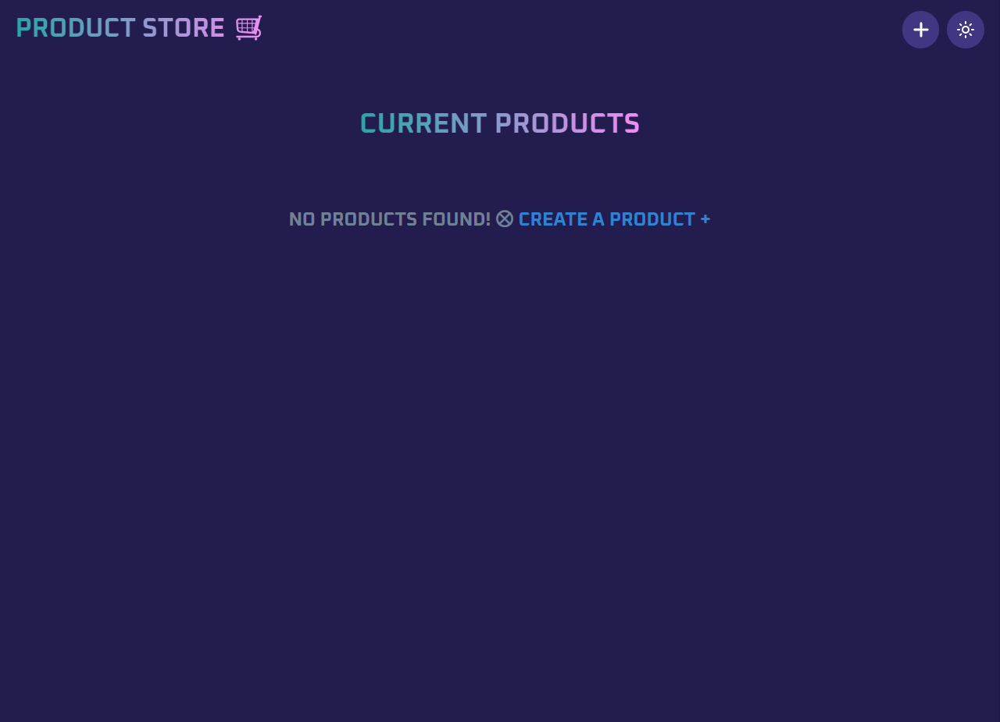
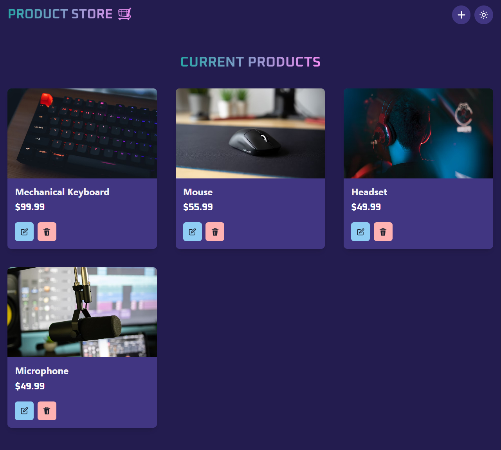
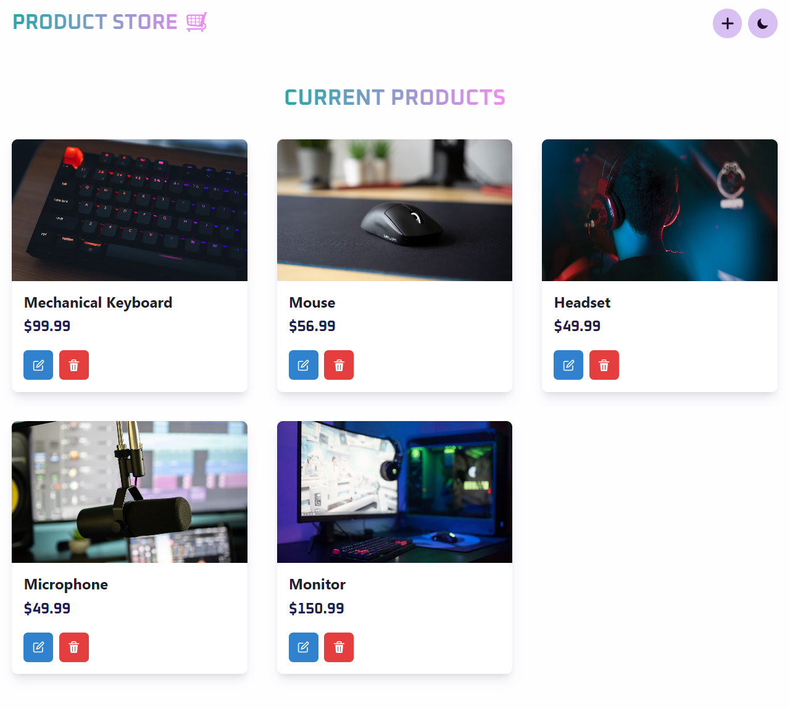
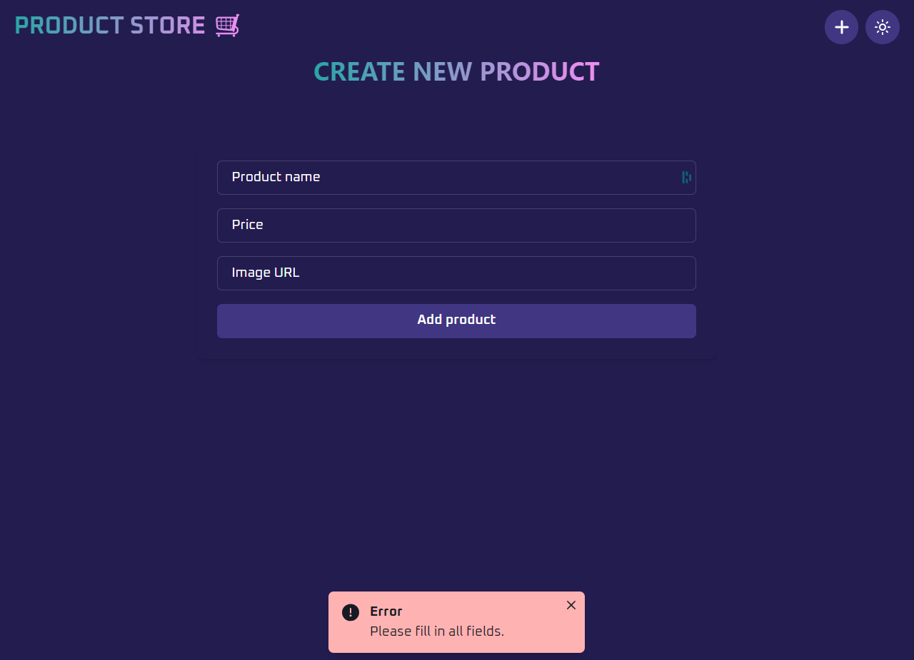
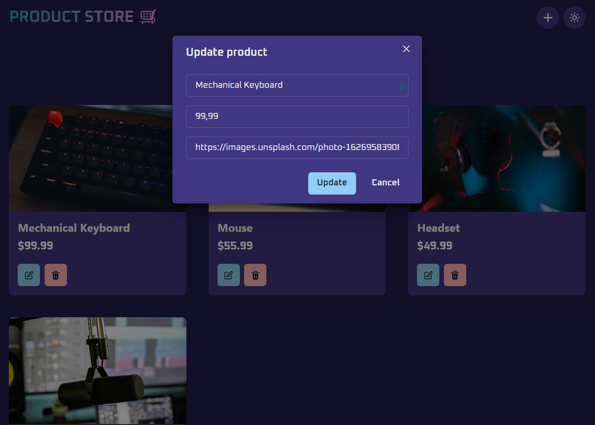
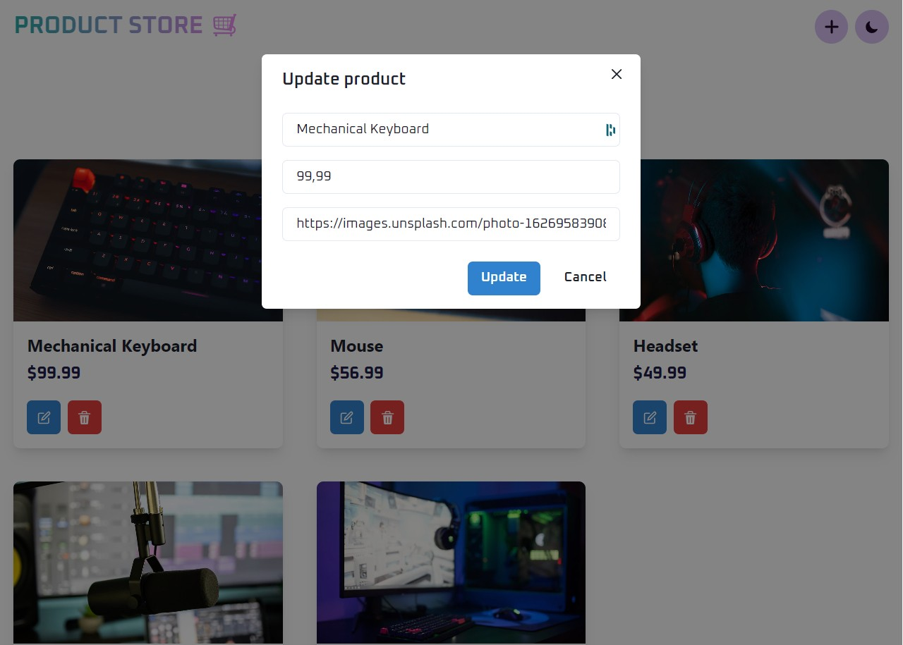

# Product Store

[English](#english) | [Português](#português)

# English

A fullstack product management system developed as my first project integrating frontend and backend. The application allows managing a product store with complete CRUD (Create, Read, Update, Delete) operations.
<br>

## Screenshots

<div align="center">
  <div style="display: flex; justify-content: space-between; margin-bottom: 20px;">
    
    
    
  </div>
  <div style="display: flex; justify-content: space-between;">
    
    
    
  </div>
</div>

## Features

- Product registration with name, price and image
- Edit existing products
- Remove products
- Responsive interface
- Dark mode
- Product image support

## Technologies used

### Frontend

- React.js - JavaScript library for building user interfaces
- Chakra UI - Component framework for React

### Backend

- Node.js - JavaScript runtime
- Express.js - Web framework for Node.js
- MongoDB - NoSQL database

## Prerequisites

Before starting, make sure you have the following requirements:

- Node.js installed
- MongoDB installed and running
- NPM or Yarn installed

## Installation

1. Clone the repository

```bash
git clone https://github.com/your-user/product-store.git
```

2. Install frontend dependencies

```bash
cd frontend
npm install
```

3. Install backend dependencies

```bash
cd backend
npm install
```

4. Configure environment variables

```bash
# Create a .env file in the backend directory with:
MONGODB_URI=your_mongodb_uri
PORT=5000
```

5. Run this app locally

```bash
npm run build
```

6. Start the app

```bash
npm run start
```

## Project status

The project is in its first functional version. Planned improvements:

- Add search system
- Implement category filters
- Add pagination
- Improve visual feedback of actions
- Implement authentication

---

<br>

# Português

Um sistema fullstack de gerenciamento de produtos desenvolvido como meu primeiro projeto integrando frontend e backend. A aplicação permite gerenciar uma loja de produtos com operações CRUD (Create, Read, Update, Delete) completas.

<br>

## Capturas de tela

<div align="center">
  <div style="display: flex; justify-content: space-between; margin-bottom: 20px;">
    
    
    
  </div>
  <div style="display: flex; justify-content: space-between;">
    
    
    
  </div>
</div>

## Funcionalidades

- Cadastro de produtos com nome, preço e imagem
- Edição de produtos existentes
- Remoção de produtos
- Interface responsiva
- Tema dark mode
- Suporte a imagens de produtos

## Tecnologias utilizadas

### Frontend

- React.js - Biblioteca JavaScript para construção de interfaces
- Chakra UI - Framework de componentes para React

### Backend

- Node.js - Runtime JavaScript
- Express.js - Framework web para Node.js
- MongoDB - Banco de dados NoSQL

## Pré-requisitos

Antes de começar, verifique se você tem os seguintes requisitos:

- Node.js instalado
- MongoDB instalado e rodando
- NPM ou Yarn instalado

## Instalação

1. Clone o repositório

```bash
git clone https://github.com/seu-usuario/product-store.git
```

2. Instale as dependências do frontend

```bash
cd frontend
npm install
```

3. Instale as dependências do backend

```bash
cd backend
npm install
```

4. Configure as variáveis de ambiente

```bash
# Crie um arquivo .env no diretório backend com:
MONGODB_URI=sua_uri_do_mongodb
PORT=5000
```

5. Execute este aplicativo localmente

```bash
npm run build
```

6. Inicie o aplicativo

```bash
npm run start
```

## Status do projeto

O projeto está em sua primeira versão funcional. Melhorias planejadas:

- Adicionar sistema de busca
- Implementar filtros por categoria
- Adicionar paginação
- Melhorar feedback visual de ações
- Implementar autenticação